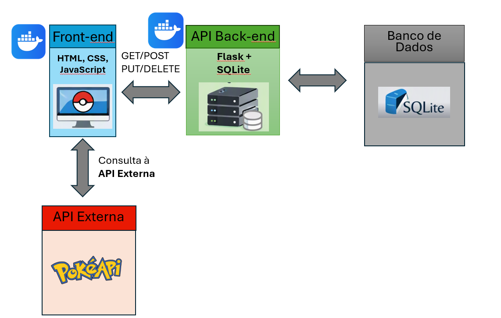

# Pokédex API

Este projeto faz parte do trabalho de conclusão da disciplina **Arquitetura de Software**.  
A aplicação consiste em uma **API REST em Python (Flask)** para gerenciar Pokémons em uma Pokédex, com persistência em **SQLite**.  
Ela permite cadastrar, listar, buscar, atualizar e excluir Pokémons, além de se comunicar com uma **API externa (PokéAPI)** para enriquecer os dados.

## 🚀 Funcionalidades

    POST /cadastrar_pokemon → Cadastrar novo Pokémon
    GET /pokemons → Listar todos os Pokémons
    GET /buscar_pokemon?id=... → Buscar Pokémon por ID
    PUT /atualizar_pokemon?id=... → Atualizar dados de um Pokémon 
    DELETE /deletar_pokemon?id=... → Excluir Pokémon por ID
    GET /pokemon_externo?nome=... → Consultar dados adicionais na PokéAPI  

## 📦 Pré-requisitos

Antes de executar a aplicação, certifique-se de ter instalado:

- **Python 3.10+**
- **pip** (gerenciador de pacotes do Python)
- **Docker** (para execução em container)
- (Opcional) **virtualenv** para criação de ambientes virtuais isolados

## Como executar

Será necessário ter todas as libs python listadas no requirements.txt instaladas. Após clonar o repositório, vá até o diretório raiz e execute:

    É fortemente indicado o uso de ambientes virtuais do tipo virtualenv.

(env)$ pip install -r requirements.txt

Este comando instala as dependências/bibliotecas, descritas no arquivo requirements.txt.

Para executar a API basta executar:

(env)$ flask run --host 0.0.0.0 --port 5000

Em modo de desenvolvimento é recomendado executar utilizando o parâmetro reload, que reiniciará o servidor automaticamente após uma mudança no código fonte.

(env)$ flask run --host 0.0.0.0 --port 5000 --reload

O servidor estará disponível em http://127.0.0.1:5000

## 🌐 API Externa Utilizada

Este projeto consome dados da **PokéAPI**, uma API pública e gratuita que fornece informações detalhadas sobre Pokémons.  
- **Link oficial:** https://pokeapi.co/  
- **Licença:** Pública e gratuita, sem necessidade de cadastro.  
- **Rotas utilizadas:**  
  - `GET https://pokeapi.co/api/v2/pokemon/{nome}` → retorna dados de um Pokémon específico, incluindo altura, peso e habilidades.  

Os dados obtidos da PokéAPI são tratados e exibidos na nossa aplicação, sem redirecionamento para outra interface externa.

## Arquitetura da Aplicação 

[Frontend SPA]  --->  [API Pokédex]  --->  [PokéAPI Externa]

